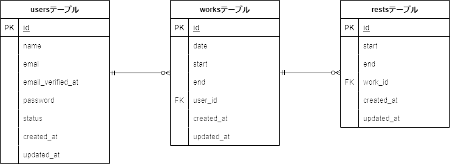

# 勤怠システム
勤怠システムを作成してみました。
ログインの後、勤務開始・終了・休憩開始・終了時間の管理ができる。
勤務開始・終了は１日１回の押下、休憩は勤務開始ボタン押下後複数回押下できる仕様。
-1.png>)

# 機能
ログイン機能、勤務のボタンによる制御、勤務時間と休憩時間の管理

# 使用技術
Laravel 8
Docker
PHP

# テーブル設計
.png>)

# ER図
